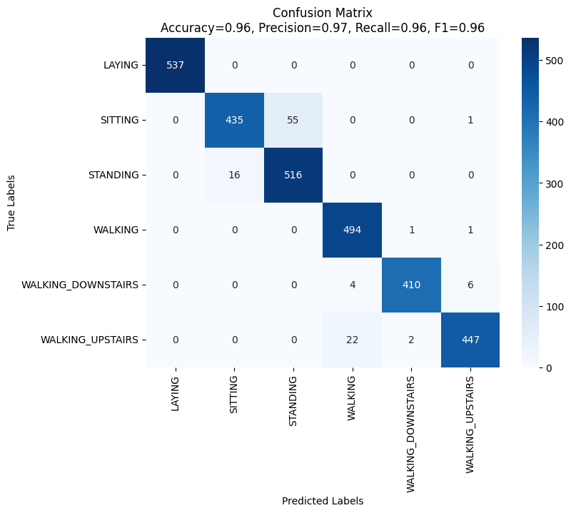
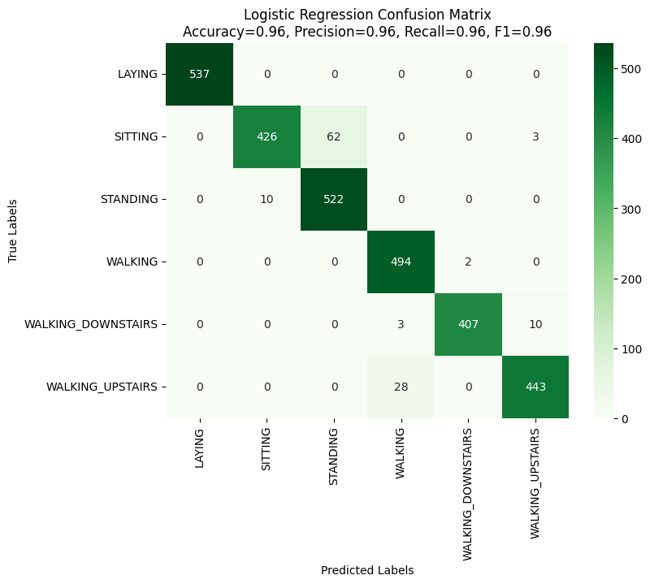

# Human Activity Recognition Using Smartphone Sensor Data

## Project Overview

This project performs a comparative analysis of multiple supervised machine learning algorithms on the Human Activity Recognition (HAR) dataset.

Using smartphone accelerometer and gyroscope sensor data, the system classifies six daily human activities. The objective is to evaluate and compare how different models perform in recognizing human movements from high-dimensional sensor features.

The project includes:

- Data loading and preprocessing  
- Feature scaling and optional data augmentation  
- Training multiple machine learning classifiers  
- Performance evaluation using accuracy, precision, recall, and F1-score  
- Confusion matrix visualization for error analysis  

---

## Dataset

This project uses the **UCI Human Activity Recognition Dataset**.

### Dataset Details:
- 30 participants
- Smartphone worn on the waist
- 50Hz sensor sampling rate
- 561 engineered features (time and frequency domain)
- 6 Activities:
  - WALKING
  - WALKING_UPSTAIRS
  - WALKING_DOWNSTAIRS
  - SITTING
  - STANDING
  - LAYING

The raw signals were segmented into fixed 2.56-second windows and transformed into feature vectors.

---

## Project Structure

```
Human-Activity-Recognitions/
│
├── data/
│   ├── train.csv
│   ├── test.csv
│   ├── activity_labels.txt
│   ├── features.txt
│   └── features_info.txt
│
├── src/
│   ├── data_loader.py
│   ├── models.py
│   ├── augmentation.py
│   ├── train_and_evaluate.py
│
├── main.py
├── requirements.txt
└── README.md
```

---

## Models Implemented

The following machine learning models were implemented and evaluated:

- Support Vector Machine (Linear Kernel)
- Support Vector Machine (RBF Kernel)
- Support Vector Machine (Polynomial Kernel)
- Logistic Regression

---

## Model Performance (Test Set)

| Model | Test Accuracy |
|-------|--------------|
| SVM (Polynomial) | 91.78% |
| SVM (RBF) | 93.08% |
| **SVM (Linear)** | 96.34%  |
| Logistic Regression | 95.99% |

### Best Performing Model: Linear SVM

- Accuracy: **96.34%**
- Precision (macro): 0.97
- Recall (macro): 0.96
- F1-score (macro): 0.96

The Linear SVM achieved the best generalization performance on the test dataset.

---

## Confusion Matrix — Linear SVM




The model shows near-perfect classification for LAYING and strong performance across all walking activities. Most confusion occurs between SITTING and STANDING, which have similar posture patterns.

---

## Logistic Regression Confusion Matrix





Logistic Regression also demonstrates strong performance with minimal class confusion.

---

## Key Observations

- Linear SVM performs best on high-dimensional sensor features.
- Slight overfitting is visible due to high training accuracy (~99%), but test performance remains strong.
- Posture-based activities (SITTING vs STANDING) are more difficult to separate.
- Walking-related classes are classified with high precision and recall.

---

## How to Run

### 1️⃣ Clone the repository

```bash
git clone https://github.com/omikayelyan/Human-Activity-Recognitions.git
cd Human-Activity-Recognitions
```

### 2️⃣ Create virtual environment (recommended)

```bash
python3 -m venv .venv
source .venv/bin/activate
```

### 3️⃣ Install dependencies

```bash
pip install -r requirements.txt
```

### 4️⃣ Run training

```bash
python main.py
```

The script will:
- Train all implemented models
- Print evaluation metrics
- Display confusion matrices

---

## Applications

- Health monitoring systems  
- Fitness tracking applications  
- Fall detection systems  
- Smart home automation  
- Behavioral analytics  

---
