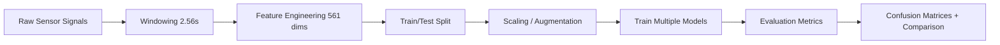
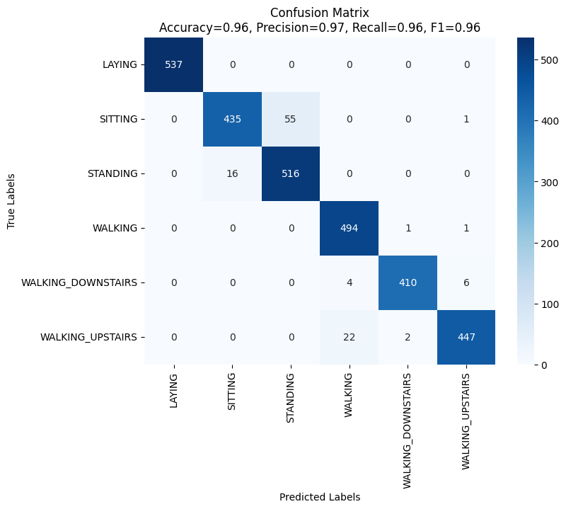
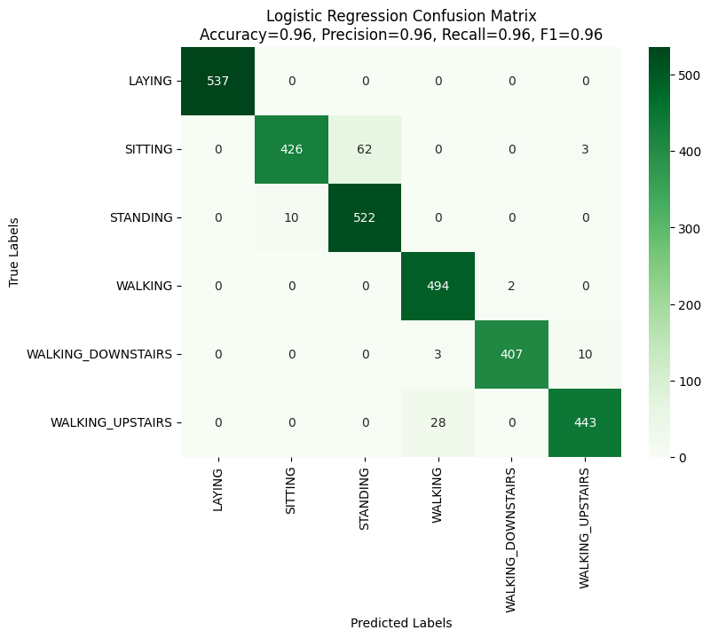

# Human Activity Recognition (HAR) using Smartphone Sensor Data


A complete classical machine learning pipeline for **Human Activity Recognition** (HAR) using **smartphone accelerometer + gyroscope** signals from the UCI HAR dataset.  
This repository trains and compares multiple supervised classifiers and reports metrics + confusion matrices.

---

## Table of Contents
- [Project Overview](#project-overview)
- [Dataset](#dataset)
- [Pipeline](#pipeline)
- [Project Structure](#project-structure)
- [Models Implemented](#models-implemented)
- [Results](#results)
- [Mathematical Foundations](#mathematical-foundations)
- [Data Augmentation Strategy](#data-augmentation-strategy)
- [How to Run](#how-to-run)
- [Reproducibility](#reproducibility)
- [Applications](#applications)
- [Contributing](#contributing)
- [License](#license)
- [Acknowledgements](#acknowledgements)

---

## Project Overview

This project performs a **comparative analysis** of multiple supervised machine learning models on a Human Activity Recognition dataset.

Using smartphone sensor features, the system classifies **six daily activities**.  
The main goal is to evaluate how different algorithms behave on **high-dimensional engineered features (561 features)** and to identify which models generalize best.

### What’s included
- Data loading and preprocessing  
- Feature scaling + optional augmentation  
- Training multiple classifiers  
- Evaluation (accuracy, precision, recall, F1-score)  
- Confusion matrix visualization for error analysis  

---

## Dataset

This project uses the **UCI Human Activity Recognition Dataset**.

### Dataset Details
- 30 participants  
- Smartphone worn on the waist  
- 50Hz sensor sampling rate  
- 561 engineered features (time + frequency domain)  
- 6 Activities:
  - WALKING
  - WALKING_UPSTAIRS
  - WALKING_DOWNSTAIRS
  - SITTING
  - STANDING
  - LAYING

Signals are segmented into fixed **2.56s windows** and transformed into feature vectors.

> Dataset reference (official):  
> https://archive.ics.uci.edu/dataset/240/human+activity+recognition+using+smartphones

---

## Pipeline


```mermaid
flowchart LR
    A[Raw Sensor Signals] --> B[Windowing 2.56s]
    B --> C[Feature Engineering 561 dims]
    C --> D[Train/Test Split]
    D --> E[Scaling / Augmentation]
    E --> F[Train Multiple Models]
    F --> G[Evaluation Metrics]
    G --> H[Confusion Matrices + Comparison]
```

---

## Project Structure

```
Human-Activity-Recognitions/
│
├── data/
│   ├── train.csv
│   ├── test.csv
│   ├── activity_labels.txt
│   ├── features.txt
│   └── features_info.txt
│
├── src/
│   ├── data_loader.py
│   ├── models.py
│   ├── augmentation.py
│   ├── train_and_evaluate.py
│
├── assets/
│   ├── svm_linear_confusion.png
│   └── logistic_confusion.png
│
├── main.py
├── requirements.txt
└── README.md
```

---

## Models Implemented

All models are defined in `src/models.py` via `get_models()` for easy iteration and benchmarking.

### Models included
- **SVM (Linear Kernel)**
- **SVM (Polynomial Kernel, degree=3)**
- **SVM (RBF Kernel)**
- **Logistic Regression**
- **Decision Tree**
- **K-Nearest Neighbors (KNN)**
- **AdaBoost**

### Exact configuration (from `models.py`)
| Model | scikit-learn Estimator | Hyperparameters |
|------|-------------------------|----------------|
| SVM Linear | `SVC` | `kernel='linear'` |
| SVM Poly | `SVC` | `kernel='poly', degree=3` |
| SVM RBF | `SVC` | `kernel='rbf'` |
| Logistic Regression | `LogisticRegression` | `max_iter=1000` |
| Decision Tree | `DecisionTreeClassifier` | `max_depth=3` |
| KNN | `KNeighborsClassifier` | `n_neighbors=5` |
| AdaBoost | `AdaBoostClassifier` | `n_estimators=100, learning_rate=0.5, random_state=42` |

> Note: For parameters not explicitly set above, **scikit-learn defaults** are used.

---

## Results

### Model Performance (Test Set)
| Model | Test Accuracy |
|-------|--------------|
| SVM (Polynomial) | 91.78% |
| SVM (RBF) | 93.08% |
| **SVM (Linear)** | **96.34%** |
| Logistic Regression | 95.99% |

### Best Performing Model: Linear SVM
- Accuracy: **96.34%**
- Precision (macro): 0.97
- Recall (macro): 0.96
- F1-score (macro): 0.96

### Why Linear SVM wins here
- HAR features are **high-dimensional (561)** and engineered
- Linear decision boundaries often generalize extremely well in such feature spaces
- Margin maximization helps reduce overfitting

---

## Confusion Matrices

### Linear SVM


Key insight: Very strong classification for **LAYING** and walking activities.  
Most confusion occurs between **SITTING** and **STANDING** due to similar posture patterns.

### Logistic Regression


Logistic Regression also shows strong generalization with minimal class confusion.

---

## Mathematical Foundations

This section explains the mathematical objective behind each implemented model.

### Notation
- Dataset: $(x_i, y_i)$ for $i=1,\dots,n$
- Feature vector: $x_i \in \mathbb{R}^d$
- Classes: 6 activities (multi-class setting)

---

### 1) Support Vector Machine (SVM)

**Goal:** Find a separating hyperplane with maximum margin.

For binary classification:

$$
f(x) = w^{\top}x + b
$$

Hard-margin objective:

$$
\min_{w,b} \frac{1}{2}\lVert w\rVert^2
\quad \text{s.t.} \quad y_i\big(w^{\top}x_i + b\big)\ge 1
$$

Soft-margin (general case):

$$
\min_{w,b}\; \frac{1}{2}\lVert w\rVert^2 + C\sum_{i=1}^n \xi_i
\quad \text{s.t.}\quad y_i\big(w^{\top}x_i+b\big)\ge 1-\xi_i,\;\xi_i\ge0
$$

#### Kernel trick
SVM can be extended to non-linear decision boundaries via:

$$
K(x_i,x_j)=\phi(x_i)^{\top}\phi(x_j)
$$

- **Linear:** $K(x_i,x_j)=x_i^{\top}x_j$
- **Polynomial:** $K(x_i,x_j)=(x_i^{\top}x_j + 1)^p$
- **RBF:** $K(x_i,x_j)=\exp\!\big(-\gamma\lVert x_i-x_j\rVert^2\big)$

In multi-class problems, scikit-learn internally handles class separation (e.g., one-vs-one).

---

### 2) Logistic Regression

Logistic Regression models class probabilities. For binary classification:

$$
p(y=1\mid x)=\sigma(w^{\top}x+b)=\frac{1}{1+e^{-(w^{\top}x+b)}}
$$

Loss minimized (cross-entropy):

$$
L=-\sum_{i=1}^n \left[y_i\log p_i + (1-y_i)\log(1-p_i)\right]
$$

For multi-class classification, a softmax-based formulation is used:

$$
P(y=k\mid x)=\frac{e^{w_k^{\top}x}}{\sum_{j=1}^{K}e^{w_j^{\top}x}}
$$

---

### 3) Decision Tree

A Decision Tree splits data to reduce class impurity.

Two common impurity measures:

**Gini impurity**

$$
G = 1-\sum_{k=1}^{K}p_k^2
$$

**Entropy**

$$
H = -\sum_{k=1}^{K} p_k \log p_k
$$

The model selects feature thresholds that maximize information gain (reduce impurity).

Depth is limited here (`max_depth=3`) to avoid overfitting.

---

### 4) K-Nearest Neighbors (KNN)

KNN is instance-based:
- Find the $k$ closest points to $x$
- Predict by majority vote

Euclidean distance:

$$
d(x_i,x_j)=\sqrt{\sum_{m=1}^{d}(x_{im}-x_{jm})^2}
$$

Because it relies on distances, scaling/standardization is very important.

---

### 5) AdaBoost (Adaptive Boosting)

AdaBoost builds an ensemble of weak learners $h_t(x)$. Final classifier:

$$
F(x)=\sum_{t=1}^{T}\alpha_t h_t(x)
$$

Misclassified samples receive higher weight during training:

$$
w_i^{(t+1)} = w_i^{(t)} \exp\!\big(-\alpha_t y_i\, h_t(x_i)\big)
$$

This focuses learning on “hard” examples and improves generalization.

### Feature Standardization

Each feature is transformed using:

$$
z = \frac{x - \mu}{\sigma}
$$

where:
- $\mu$ = mean of training feature  
- $\sigma$ = std of training feature  

---

### Dataset Expansion

The scaled dataset is concatenated with the original:

$$
X' =
\begin{bmatrix}
X\\
\mathrm{Scale}(X)
\end{bmatrix},
\quad
y' =
\begin{bmatrix}
y\\
y
\end{bmatrix}
$$

This doubles training samples while preserving labels, improving stability and potentially generalization.

## How to Run

### 1) Clone repository
```bash
git clone https://github.com/omikayelyan/Human-Activity-Recognitions.git
cd Human-Activity-Recognitions
```

### 2) Create virtual environment (recommended)
```bash
python3 -m venv .venv
source .venv/bin/activate
```

### 3) Install dependencies
```bash
pip install -r requirements.txt
```

### 4) Run training and evaluation
```bash
python main.py
```

The script will:
- Train all implemented models
- Print evaluation metrics
- Generate/display confusion matrices

---
---

## Training & Evaluation Details (`train_and_evaluate.py`)

All models are trained and evaluated using the shared utility function:

```python
train_and_evaluate(model, X_train, y_train, X_test, y_test, model_name="Model")
```

This ensures each classifier is benchmarked under the **same evaluation protocol**.

---

### Training Procedure

Given a scikit-learn estimator `model`, the training step is:

$$
\hat{f} \leftarrow \mathrm{Fit}(X_{\mathrm{train}}, y_{\mathrm{train}})
$$

---

### Predictions

After training, predictions are produced on both the training and test sets:

$$
\hat{y}_{\text{train}} = \hat{f}(X_{\text{train}}), \quad
\hat{y}_{\text{test}} = \hat{f}(X_{\text{test}})
$$

---

### Metrics Reported

#### 1) Accuracy (Train + Test)

$$
\mathrm{Accuracy}=\frac{1}{n}\sum_{i=1}^{n}\mathbf{1}\!\left[\hat{y}_i=y_i\right]
$$

---

#### 2) Precision, Recall, F1 (Macro Averaged)

For a class $k$:

$$
\text{Precision}_k = \frac{TP_k}{TP_k + FP_k}
$$

$$
\text{Recall}_k = \frac{TP_k}{TP_k + FN_k}
$$

$$
F1_k = \frac{2 \cdot \text{Precision}_k \cdot \text{Recall}_k}{\text{Precision}_k + \text{Recall}_k}
$$

Macro versions:

$$
\text{Precision}_{\text{macro}} = \frac{1}{K}\sum_{k=1}^{K} \text{Precision}_k
$$

$$
\text{Recall}_{\text{macro}} = \frac{1}{K}\sum_{k=1}^{K} \text{Recall}_k
$$

$$
F1_{\text{macro}} = \frac{1}{K}\sum_{k=1}^{K} F1_k
$$

---

### Confusion Matrix

The confusion matrix $C$ is computed as:

$$
C_{i,j}=\sum_{r=1}^{n} I\!\left(y_r=i \wedge \hat{y}_r=j\right)
$$

### Visualization Behavior

Each run plots a confusion matrix with a **randomly selected color palette** from:

- `Blues`, `Greens`, `Reds`, `Purples`, `Oranges`, `coolwarm`, `YlGnBu`

This is done via:

```python
palette = np.random.choice(color_palettes)
sns.heatmap(cm, annot=True, fmt='d', cmap=palette, cbar=False)
```

> Note: Since the palette is random, the confusion matrix style may look different on each run, but the values remain the same.

---

### Output Summary

For each model, the terminal output includes:

- Training Accuracy  
- Test Accuracy  
- Precision (macro)  
- Recall (macro)  
- F1-score (macro)  
- Classification report  
- Confusion matrix plot  

Finally, the trained `model` is returned for optional reuse:

```python
return model
```

---

## Reproducibility

To ensure consistent results:
- Fixed `random_state=42` in AdaBoost
- Dataset split is fixed (UCI provided train/test)
- Same preprocessing applied to all models

> Small variations may occur depending on OS / BLAS backend / library versions.

---

## Applications

- Health monitoring systems  
- Fitness tracking applications  
- Fall detection systems  
- Smart home automation  
- Behavioral analytics  

---

## Contributing

Contributions are welcome!
- Add new models (e.g., Random Forest, XGBoost)
- Add hyperparameter tuning (GridSearchCV)
- Add feature selection (PCA, SelectKBest)
- Add cross-validation reporting

---

## License

MIT License (recommended).  
If you don’t have a license yet, add a `LICENSE` file with MIT text.

---

## Acknowledgements

- UCI Machine Learning Repository — Human Activity Recognition Using Smartphones dataset  
- scikit-learn library for classical ML implementations  
